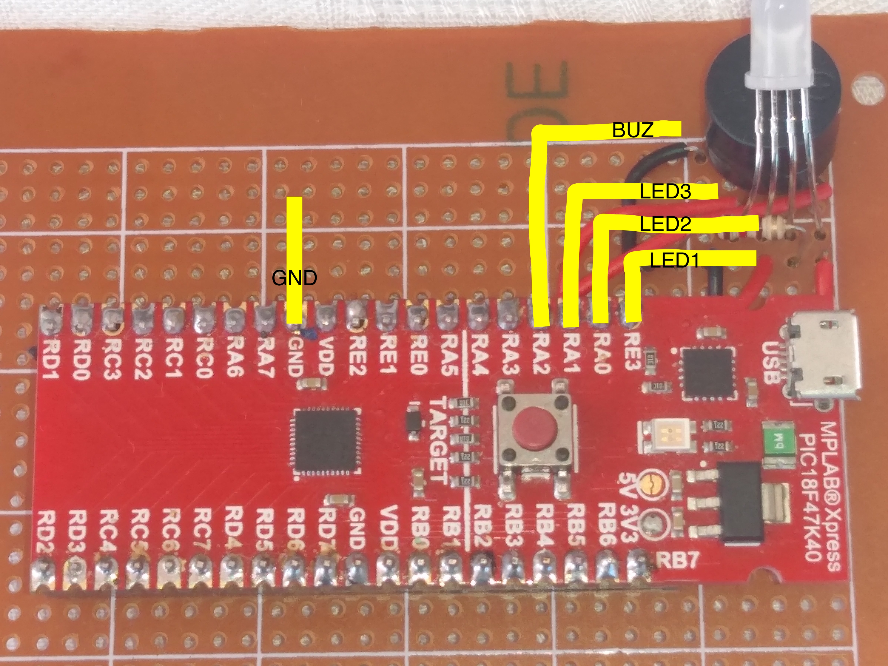
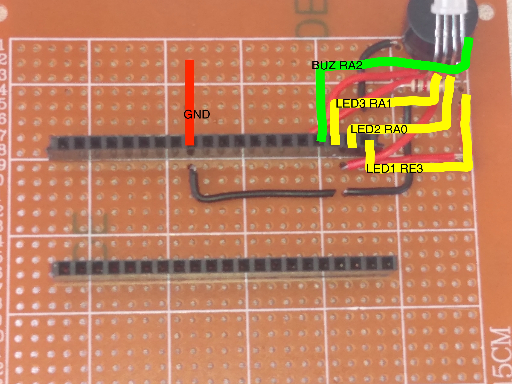
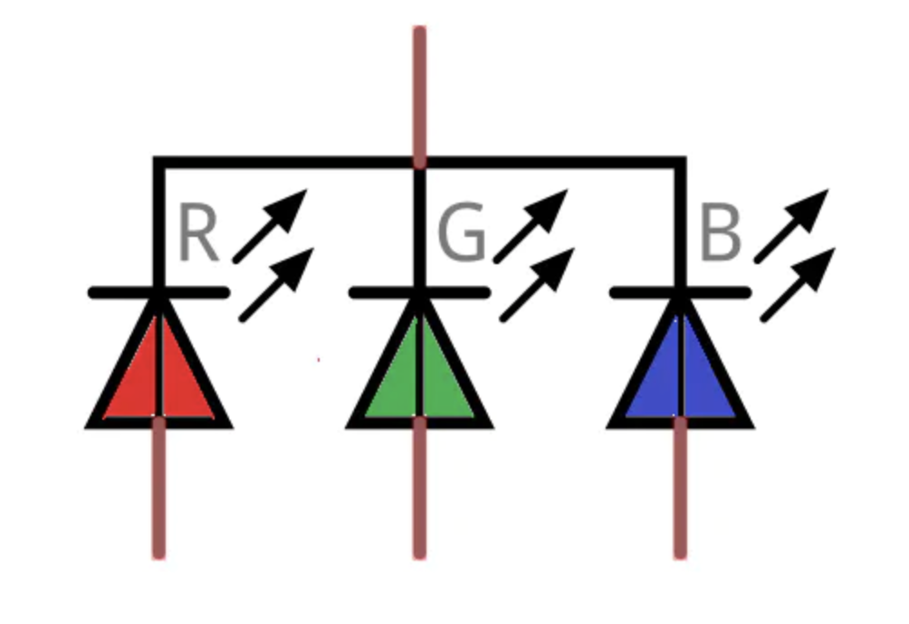
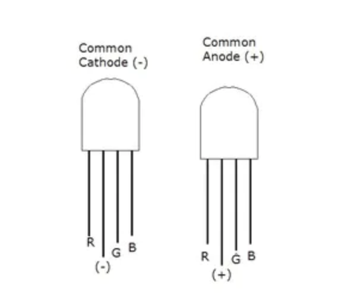

# Robot circuit based on PIC18F

## Circuit:
It is based on microchip card : [card](https://www.microchip.com/en-us/development-tool/DM182027)

we connected three color leds, and buzzer to expriment first with the card, and use them later as error or state indicators for debugging, when we progress in the robot development,
the pictures bellow taken by phone to show the initial circuit we start with:

# myRobots

### 3 Color Leds:

the arduino programe 

